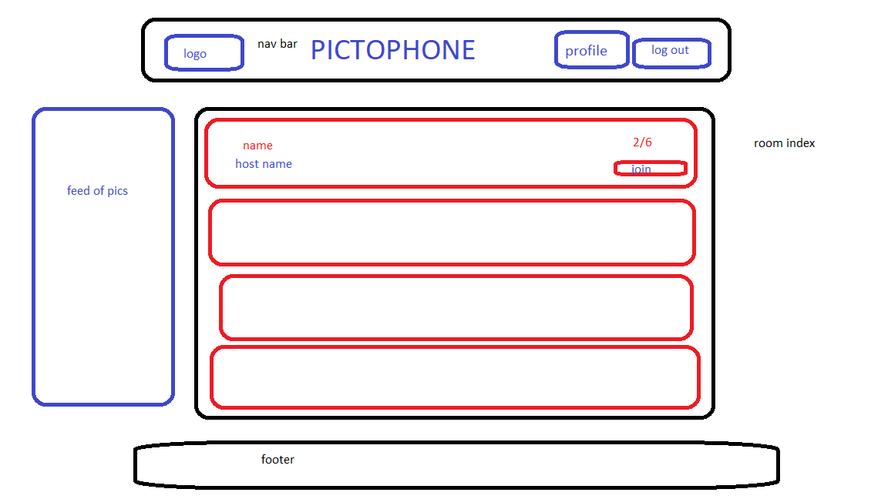

# Pictophone

 Pictophone is an online mulitplayer experience that lets users play a collaborative drawing game.

## Background and Overview

Do you remember people? Not photos of them on your screen, but a real live breathing person within 6 feet of you? It seems so long ago that we could gather and play drawing based games! In a post Among Us society we yearn for the next online group experience. 
Enter Pictophone

Pictophone lets people join an online community of Pictophonerstm where you can create online party rooms. After joining a room the users can communicate via live chat while they are waiting for the start of the game. 

During gameplay each player will receive a prompt and attempt to draw it within a given time. Once the time has elapsed their drawing will be passed to the subsequent player, who will guess the prompt! Their guess is then passed to the next player who will draw based off of the guess! The cycle continues until the last player in the cycle guesses. When the cycle ends players will see the journey their drawings/prompts took and how they mutated over time. 

## We will need to:

* Create a splash page that allows users to create a Pictophone account or login with an existing account
    * Also will have the option for a guest login
* Create a main lobby where all ongoing pictophone games are listed
    * if not fully occupied users can join the room as a player
    * BONUS: Users can join a full room as an audience member
* When players join a room there will be a live chat available as well as a free draw board before the game begins
* When the game begins each player recieves a distinct randomized prompt and has a specified amount of time to draw it on the provided canvas. 
    * For this we will need to provide each player with a personalized modal with a distinct drawing board
* Each player's drawing will be saved and then fetched for the subsequent player
    * For this we will need to utilize a drawing api
* Once the drawing is fetched/rendered for the next player they will post their guess which will in turn be passed to the next player.
    * and so on and so forth until the game is over which occurs when the final player in each chain makes their guess
* Each of the gueses and pictures will be displayed in order at the end of the game
    * Chat will be renabled at this point
    * BONUS: If there are viewers in the room they can score the pictures of the players at this time

## Functionality & MVP

 
* User Auth / Sign in 
* CRUD Cycle for Rooms & Main Lobby
* CRUD Cycle for Drawings
* Freedraw in rooms before the game begins
* Live chat in rooms
* BONUS: Users can draw their own avatar
* BONUS: Live feed of previous drawings in lobby

## Technologies & Technical Challenges

* Websockets - socket.io
* Drawing board - P5.js
* Asset Storage - AWS
* Passing gameplay vs shared views
* Integrating websockets into a drawing board
* hand off of assets between players
* fetch and organize assets and guesses for presentation

# Wireframes

## Splash

## Login/Signup

## Index

## Game Room

## Draw Modal

## Guess Modal

## Schedule

Alex Dziuba, Stephanie Soni, Kyle Ginzburg, Andrew Vitovitch

* Day 0
    * setup Auth -Alex

    * splash skeleton (/)  -Andrew
        * nav bar
        * main content
            * screenshots on how to play
        * footer

    * signup/login skeleton - Stephanie 
        * seperate forms (/signup, /login)

    * backend routes for everything! - Kyle
        * build users collection
            * User owns room (1 max)

* Day 1
    * main lobby index skeleton
        *(/lobby)
    * Rooms collection
        * connected to the user that built it
        * id, name, size (min: 2 (ideal 4+), max: 8, even: true)
        * Array of player ids
    * Rooms Routes
        * GET - all rooms
        * GET - individual room
        * PATCH - individual room (when players join)
        * POST - create room
        * DELETE - destroy room
    * Room skeleton
        * (/rooms/:id)

* Day 2
    * Building out frontend (Websockets & P5)
        * Chat
        * Free draw
        * Backend? (potential storage of free draw canvas)
            * collections for drawings
                * id, room_id, user_id, chain_id(letter),  asset_link, timestamps
            * guess collection
                *  id, user_id, guess
        * start on game logic

* Day 3
    * Build out frontend draw and guess modals
        * drawing board - P5
    * Build Prompt Collection
        * if sampled is same as previous, sample again
    * Finish game logic
    * AWS integration - Andrew

* Day 4

* Beyond Day 4
    * BONUS!!!!
        * private/public rooms
        * password protect 
        * User Profile Page