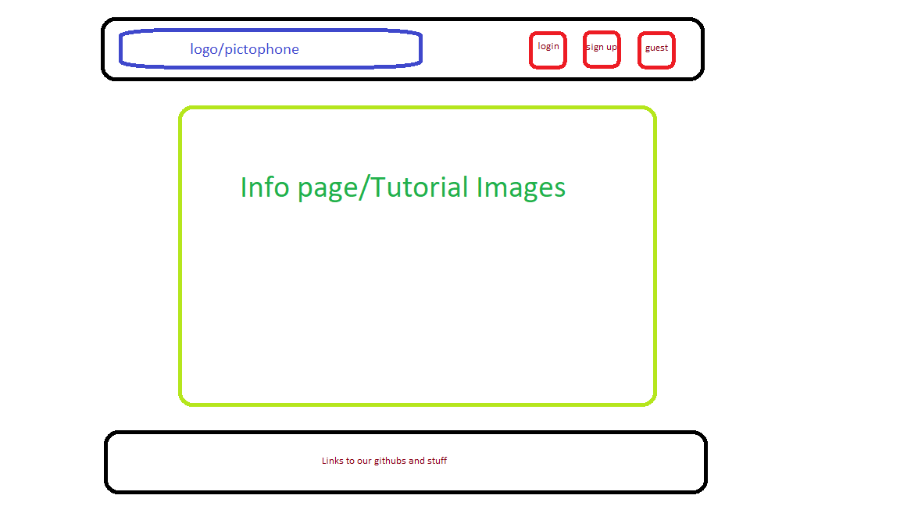
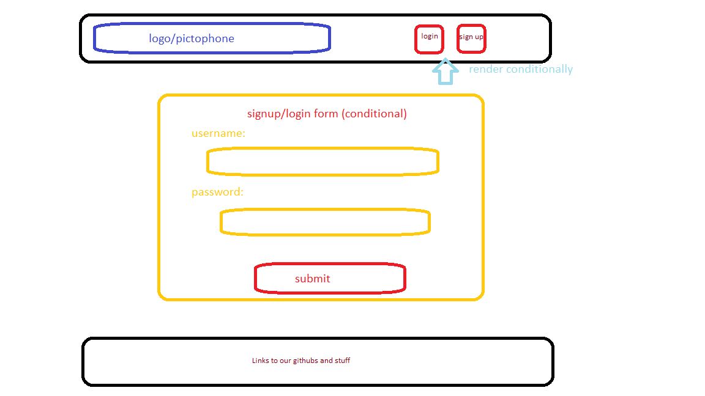
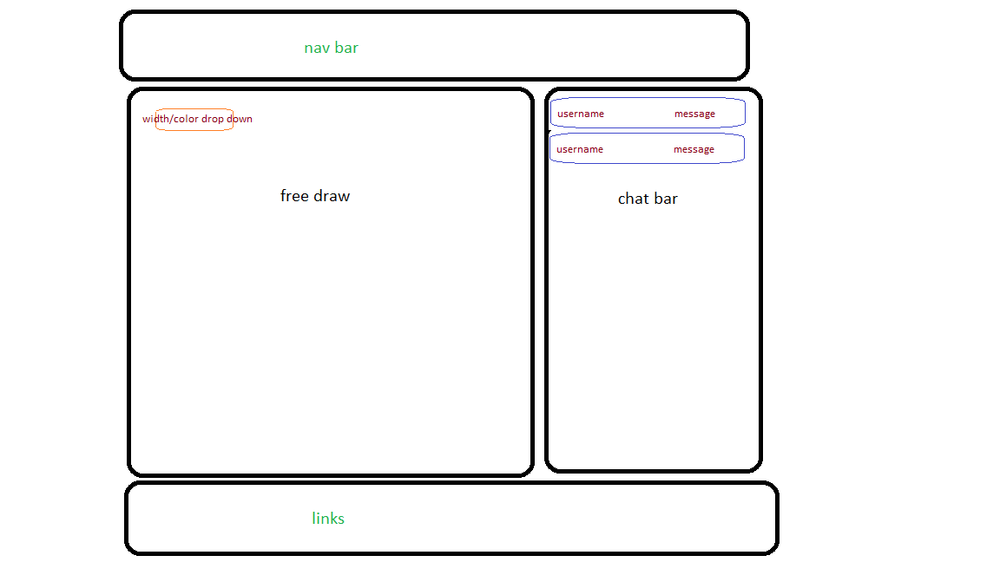
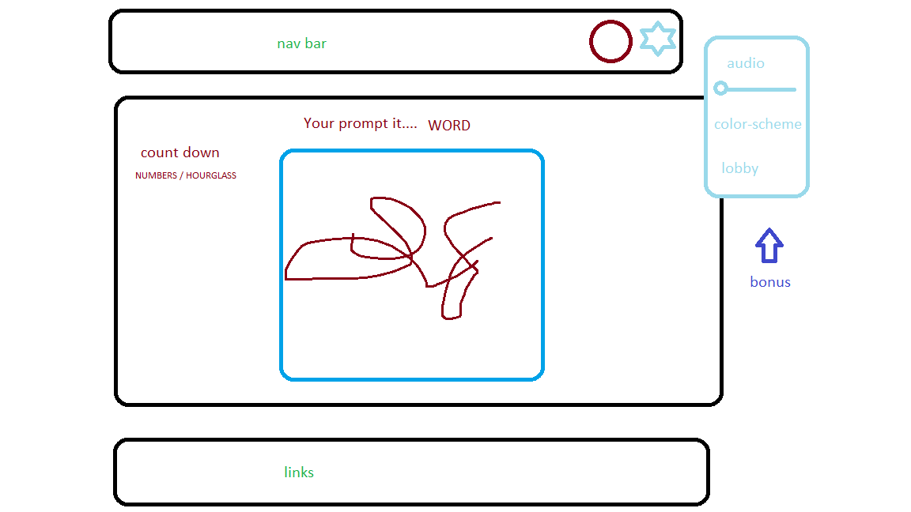
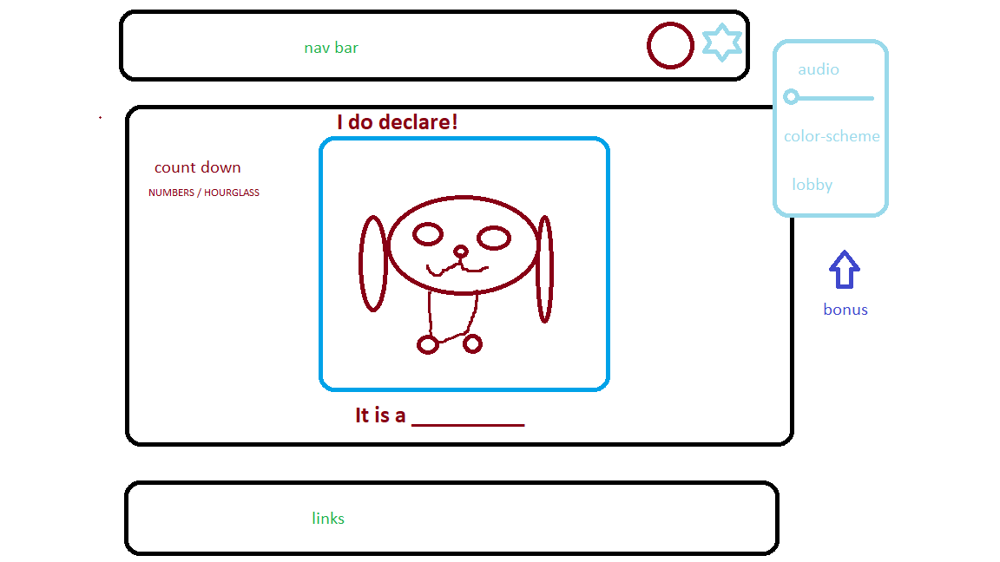

# Pictophone

 Pictophone is an online, mulitplayer, collaborative drawing game.

## Background and Overview

Do you remember people? Not photos of them on your screen, but a real live breathing person within 6 feet of you? It seems so long ago that we could gather and play drawing based games! In a post Among Us society we yearn for the next online group experience...

Enter Pictophone.

Upon signing up or logging in, Pictophonerstm can create or join their own online party rooms. Upon entering a room, a user can communicate with others in the room via live chat and participate in a communcal 'free draw' session while they are waiting for the start of the game. 

During gameplay each player will receive a unique prompt and attempt to draw it within a given time. Once the time has elapsed, their drawing will be passed to the subsequent player, who will guess the prompt! Their guess is then passed to the next player who will draw based off of the guess! The cycle continues until the last player in the cycle guesses. When the cycle ends players will see the journey their drawings/prompts took and how they mutated over time. 

## We will need to:

* Create a splash page that allows users to create a Pictophone account or login with an existing account
    * Add a guest login option
* Create a main lobby where all ongoing Pictophone games are listed
    * Maintain a record of each room's current number of players and whether the room is full or joinable
    * BONUS: Users can join a full room as an audience member
* Create a live chat and free draw board for each room, available only before and after gameplay
* Program the game flow, wherein each player receives a distince randomized prompt to start
    * Set and reset timers for each round
    * Create personalized modals for each player
* Store and fetch the drawings as needed during game play
* Transmit drawings and guesses accurately between players
* Fetch and organize all the drawings and guesses at the end of the game for review by the players
    * Re-enable chat to allow players to laugh and discuss the game
    * BONUS: If there are viewers in the room they can score the pictures of the players at this time

## Functionality & MVP

* User Auth / Sign in 
* CRUD Cycle for Rooms & Main Lobby
* CRUD Cycle for Drawings
* Freedraw in rooms before the game begins
* Live chat in rooms
* BONUS: Users can draw their own avatar
* BONUS: Live feed of previous drawings in lobby

## Technologies & Technical Challenges

Technologies:
* Websockets - socket.io
* Drawing board - canvas, P5.js
* Asset Storage - AWS

Challenges:
* Passing gameplay vs. shared views
* Integrating websockets into a drawing board
* Hand off of assets between players
* Fetching and organize assets and guesses for presentation

# Wireframes

## Splash

## Login/Signup

## Index

## Game Room

## Draw Modal

## Guess Modal

## Schedule

Frontend Lead: Alex Dziuba, 
Team Lead: Stephanie Soni, 
Backend Lead: Kyle Ginzburg
Flex Lead: Andrew Vitovitch

* Day 0
    * Setup frontend auth - Alex
    * Splash skeleton (/) - Andrew
    * Signup/login skeleton - Stephanie 
    * Backend routes for everything! - Kyle

* Day 1
    * Main lobby index skeleton - Alex
        *(/lobby)
    * Rooms collection - Stephanie
    * Rooms routes - Kyle
    * Room skeleton - Andrew

* Day 2
    * Chat - Andrew
    * Free draw - Stephanie
    * Backend collections and routes - Kyle
        * Drawings
        * Guesses
    * Start on frontend game logic - Alex

* Day 3
    * Build out frontend draw and guess modals - Alex
    * Build prompt collection - Kyle
    * Finish game logic - Stephanie
    * AWS integration - Andrew

* Day 4
    * Seed all collections - Kyle
    * Styling - Andrew
    * Testing and debugging of game - Alex
    * Deploying to Heroku - Stephanie

* Beyond Day 4
    * BONUS
        * private/public rooms
        * password protect 
        * User Profile Page
